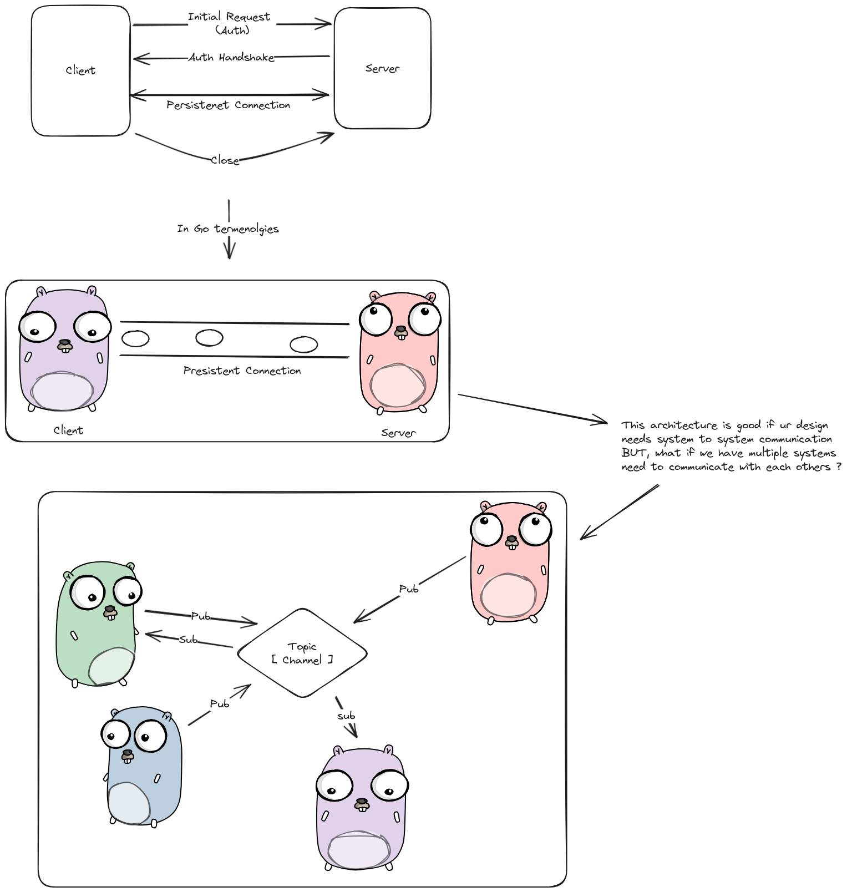

# real-time-to-go
just exploring different real-time protocols, techniques and protocols with Golang to build robust, and real time backends

# System Design 

# How to handle concurrent write on a single connection ? 

